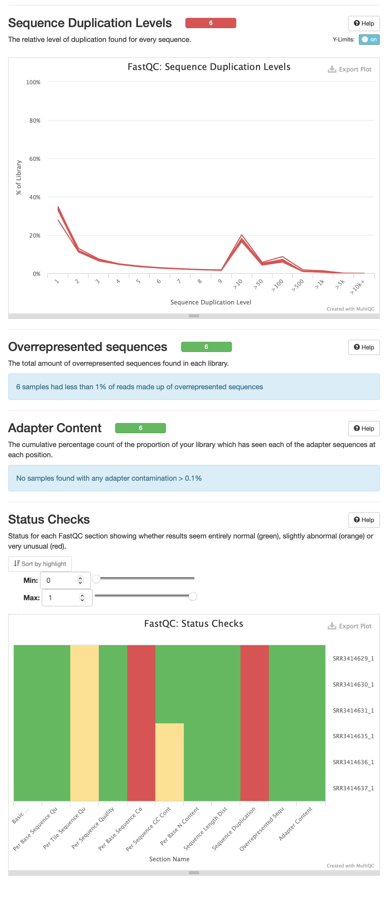

### [colab python](https://colab.research.google.com/drive/1fRkn4s6_SLthwDVrtcScgneFUeIv6Ei0?usp=sharing)

Файлы `ALL.counts` и `ALL.info` записаны в формате csv. Чтобы их прочитать из `R` у них есть копии `ALLt.counts` и `ALLt.info` в формате tsv

### statistics

Sample Name  | % Dups | % GC | Length | % Failed | M Seqs
-------------|--------|------|--------|----------|-------
SRR3414629_1 | 52.6%  | 49%  | 65 bp  | 18%      | 21.1
SRR3414630_1 | 52.7%  | 47%  | 65 bp  | 18%      | 15.2
SRR3414631_1 | 54.5%  | 49%  | 65 bp  | 18%      | 24.2
SRR3414635_1 | 54.9%  | 49%  | 65 bp  | 18%      | 21.0
SRR3414636_1 | 54.4%  | 49%  | 65 bp  | 18%      | 20.3
SRR3414637_1 | 60.2%  | 47%  | 65 bp  | 18%      | 20.4

### stats per sample

ID         | type          | total reads | unaligned      | aligned unique    | aligned non-unique
-----------|---------------|-------------|----------------|-------------------|-------------------
SRR3414629 | reprogrammed  | 21106089    | 595976 (2.82%) | 18375887 (87.06%) | 2134226 (10.11%)
SRR3414630 | reprogrammed  | 15244711    | 412032 (2.70%) | 13186133 (86.50%) | 1646546 (10.80%)
SRR3414631 | reprogrammed  | 24244069    | 696383 (2.87%) | 20928937 (86.33%) | 2618749 (10.80%)
SRR3414635 | control       | 20956475    | 560610 (2.68%) | 18428314 (87.94%) | 1967551 (9.39%)
SRR3414636 | control       | 20307147    | 550088 (2.71%) | 17825374 (87.78%) | 1931685 (9.51%)
SRR3414637 | control       | 20385570    | 538279 (2.64%) | 17844855 (87.54%) | 2002436 (9.82%)

### [colab R](https://colab.research.google.com/drive/1hjbfdSDsqYJTwIBBUZzMzDl9adN47tYG?usp=sharing)

